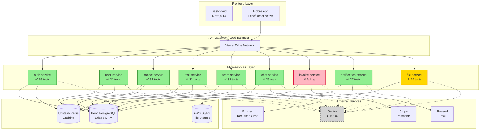
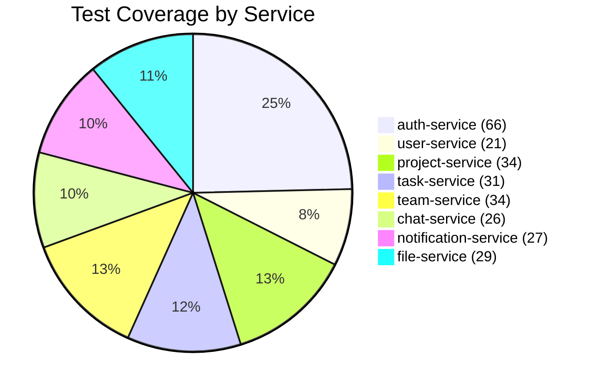
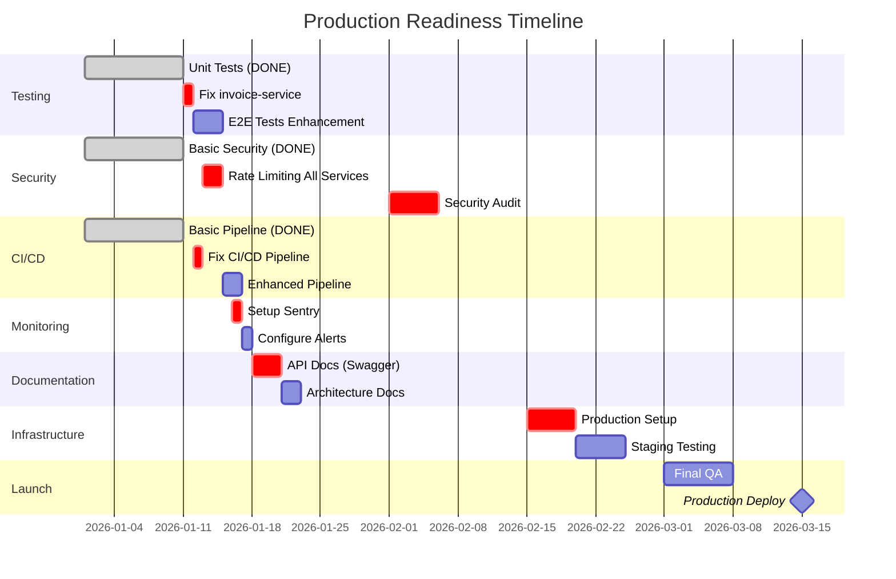
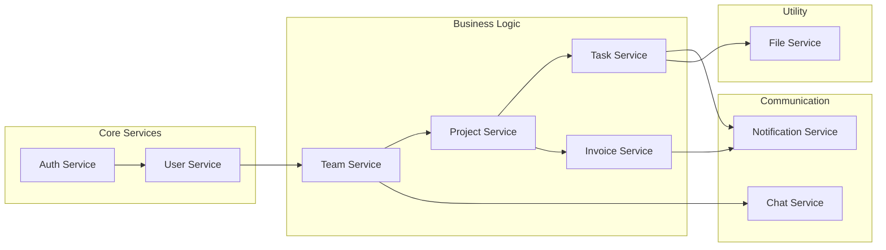
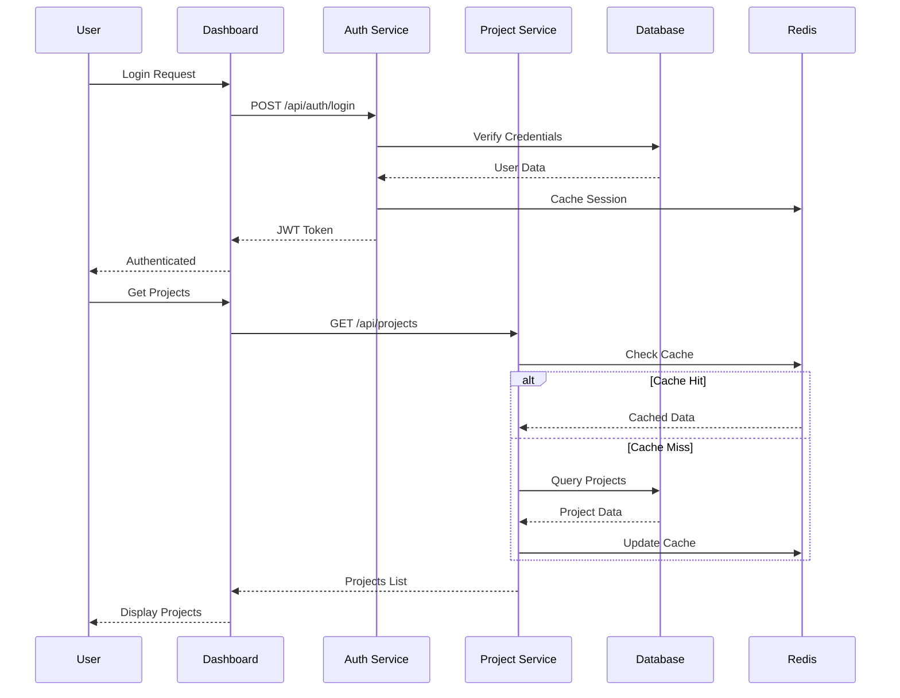

# 🏗️ Architecture Overview

## System Architecture Diagram

## Testing Status

## Production Readiness

## Service Dependencies

## Data Flow

## Current Status Summary

| Component | Status | Coverage | Priority |
|-----------|--------|----------|----------|
| **Testing** | 🟢 Good | 98.5% | Maintain |
| **Security** | 🟡 Partial | 60% | **Critical** |
| **CI/CD** | 🟡 Basic | 40% | **High** |
| **Monitoring** | 🔴 None | 0% | **Critical** |
| **Documentation** | 🔴 Minimal | 20% | **High** |
| **Infrastructure** | 🟡 Local | 40% | **Medium** |

**Legend:**
- 🟢 Good (>80%)
- 🟡 Partial (40-80%)
- 🔴 Needs Work (<40%)

## Next Steps

1. **Week 1:** Fix critical issues (invoice-service, CI/CD)
2. **Week 2-4:** Security hardening & monitoring
3. **Month 2:** Production setup & audit
4. **Month 3:** Launch preparation

**Target Launch Date: March 15, 2026** 🚀
